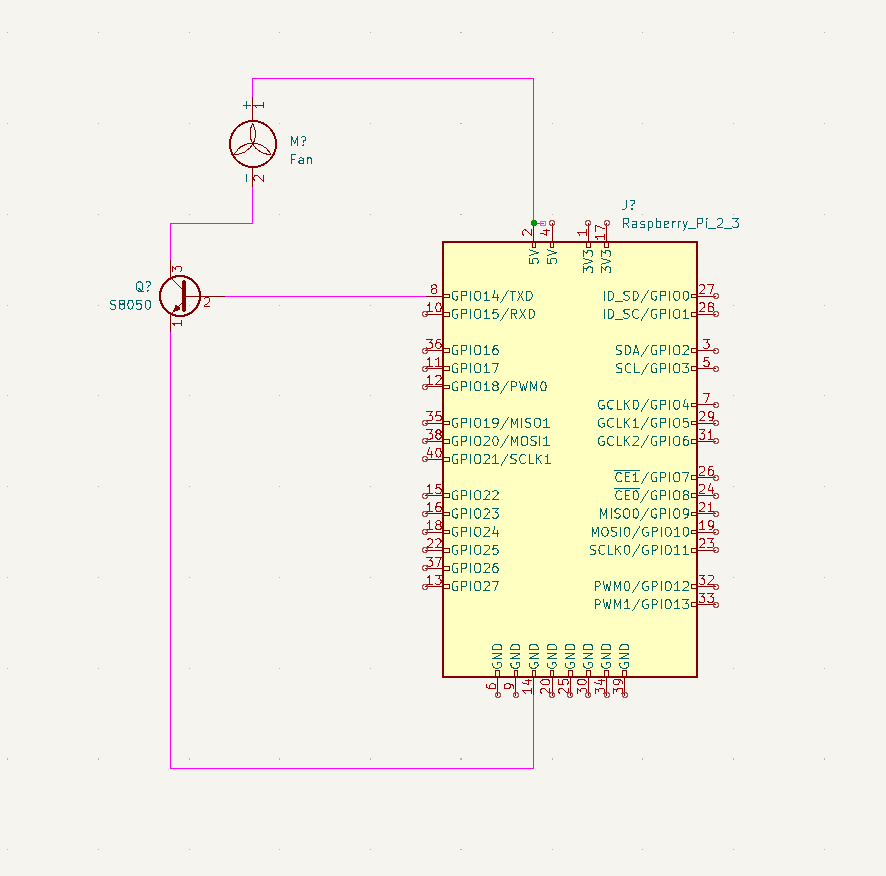

# raspberrypi-fan-controller

This program serves to turn your 5v-fan on/off when the pi reaches a certain temperature. This is set to 60°c by default and will turn off when cooled to 45°c. The script utilizes a controlled infinte loop to consisitantly monitor the temperature every 10 seconds. It therefore should be setup so as to run when the pi is first turned on.

The script utilizes < vcgencmd measure_temp > to find the current temperature of the pi.

## Setup

There are numerous methods you can use, this is just the way i've applied it. You can use an S8050 transistor to communicate with the pi & control the fan.  The below schematic shows the basic layout, controls are applied via GPIO14.

For software setup follow the below statements

    git clone https://github.com/AliCW/raspberrypi-fan-controller.git

Import the following dependencies - you will need to run this in sudo mode for the below rc.local auto-start function to work, otherwise the package will not be available for the root user. But you can always install without the sudo command if not using rc.local for auto-starting the script.

    sudo pip3 install schedule

## Auto-Start via rc.local

You will probably want to implement some auto-starting features for the fan script so you dont have to run it everytime time you start your pi. 

Navigate to the folder the fan-script has been cloned to and type the below

    pwd

Copy the path given by the command to the clipboard. Now type the below command to open rc.local in nano editor.

    sudo nano /etc/rc.local

Navigate down to the bottom of the file, one line above "exit 0" and type the below

    sudo python3 /<paste-path-to-script>/fan_script.py &

Then hold control/command 'X' to exit and 'Y' to save the changes. The '&' is very important as the script uses an infinite loop to detect temperature, if excluded, the pi will not be able to run "exit 0" within rc.local.

## Adjusting settings

Alter the GPIO pin if GPIO14 is already in use.

    fanPin = 16

You can change the temperature which engages the fan by changing the if statements, the below example changes the script so the fan engages at 70°c.

    if temperature >= 70.0: 
        GPIO.output(14,True) #turns the fan on
    if temperature < 45.0: 
        GPIO.output(14,False) #turns the fan off
